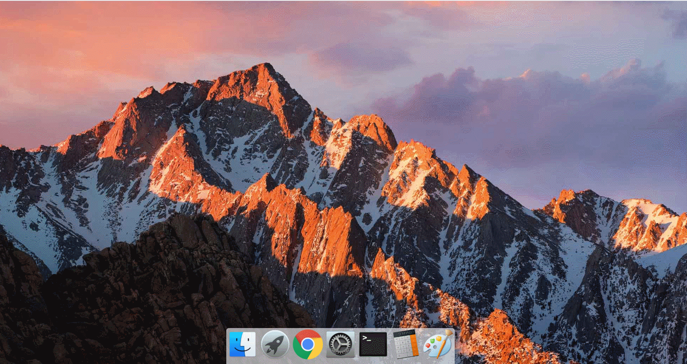
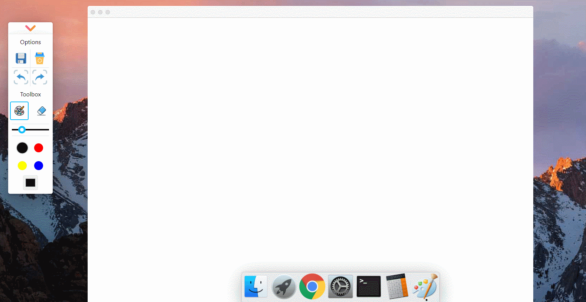

## 前言

现公司的项目的技术栈是 **vue2.x** ，自己想通过项目实践更好的学习 **react hooks** 语法，也正好为学习 **vue3.0** 铺路。最开始想实现 **画板** 和 **计算器** 两个小 demo，后来觉得不如融入到一个项目里，顺其自然的想到放到一个桌面系统中。**macOS** 的动态交互设计的很好，正好又能更好的复习 **CSS3** 的动画效果，于是就决定做一个 **macOS** 桌面。

## 项目简介

本项目是借鉴 **macOS** UI 设计和动态交互的模拟桌面，内部包含 **画板**、**计算器**、**浏览器** 等小组件。

- Docker 栏动态

  

- 画板

  - 结构图

    

  - 绘画 & 橡皮

    

  - 返回 & 前进

    

  - 画笔粗细 & 调色盘

    

  - 保存 & 清除

    

- 弹窗

  - 拖拽 & 最小化 & 最大化

    

## 项目演示

项目采用 Github actions 自动部署，如果想了解，可以看我这篇文章：[Github actions 自动部署](https://github.com/liucrystal24/Notebook/issues/13)

项目演示地址 : [https://liucrystal24.github.io/macos-desk/](https://liucrystal24.github.io/macos-desk/)

## 项目运行

:warning: 由于涉及 ES 6/7 等新属性，node 需要 6.0 以上版本

```bash
git clone https://github.com/liucrystal24/macos-desk

cd macos-desk

npm install 或 yarn(推荐)

yarn start
```

## 技术栈

##### React Hooks + TypeScript + ES 6/7 + Sass + flex

## 项目结构

#### src :

```tree
│  App.css.map
│  App.test.tsx
│  App.tsx
│  index.css
│  index.css.map
│  index.scss
│  index.tsx
│  react-app-env.d.ts
│  serviceWorker.ts
│  setupTests.ts
│
├─components
│  ├─dialog
│  │      index.tsx
│  │
│  ├─drawing
│  │      canvas.css
│  │      canvas.min.css
│  │      canvas.scss
│  │      Canvas.tsx
│  │      index.tsx
│  │
│  ├─footer
│  │      Footer.tsx
│  │      index.css
│  │      index.min.css
│  │      index.scss
│  │
│  ├─header
│  │      Header.tsx
│  │
│  ├─iconfont
│  │      index.css
│  │      index.min.css
│  │      index.scss
│  │      index.tsx
│  │
│  └─modal
│      │  Modal.tsx
│      │  UseModal.tsx
│      │
│      └─draggable
│              index.tsx
│
├─img
│
└─styles
        App.css
        App.min.css
        App.scss
        common.css
        common.min.css
        common.scss

```

## 目标功能

- [x] 底部 Docker 栏动画
- [x] 画板
  - [x] 弹窗
  - [x] 拖拽窗口
  - [x] 窗口最大化，最小化 ( **前三项已经单独组件化** )
  - [x] 保存画板
  - [x] 清空画板
  - [x] 画布历史( 撤销、前进 )
  - [x] 橡皮( 圆形擦除 )
  - [x] 画笔宽度
  - [x] 画笔调色盘
- [ ] 浏览器
- [ ] 计算器
- [ ] 通用设置
- [ ] 启动台

## 总结

1. [Dock 栏 macOS 动效原理及实现](https://github.com/liucrystal24/Notebook/issues/14)
2. [画板工具栏和状态控制](http://www.baidu.com)
3. [画板（一）：绘画和圆形橡皮擦除](https://github.com/liucrystal24/Notebook/issues/15)
4. [画板（二）：画笔宽度和调色盘](http://www.baidu.com)
5. [画板（三）：画板历史存储：撤销和前进](http://www.baidu.com)
6. [画板（四）：清空和保存画板](http://www.baidu.com)
7. [弹窗拖拽和最大化、最小化](http://www.baidu.com)
