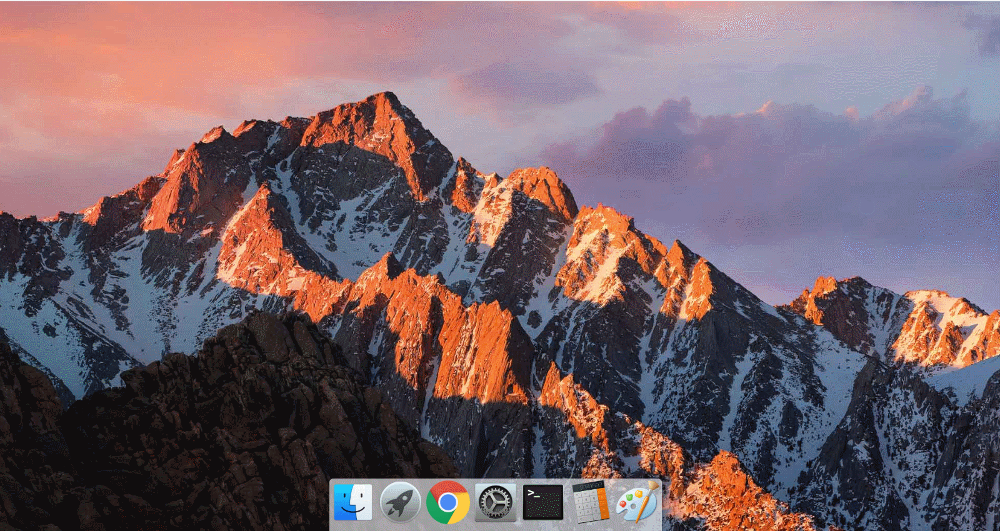

# 一、Dock 栏 macOS 动效原理及实现

:dart: [项目地址](https://liucrystal24.github.io/macos-desk)，欢迎 watch :eyes: 和 star :star:
:book: [项目预览](https://liucrystal24.github.io/macos-desk)，点击即可查看

- ### 效果图

  

- ### Dock 动效原理

  监听鼠标的 `mousemove` 事件，当鼠标滑过 dock 栏图标时，图标的宽度动态变化，图标动态宽度的计算公式为：

  **dock 栏图标动态宽度 = dock 栏图标原本宽度 \* 放大系数 \* （ 1 - 鼠标到图标中心的距离 / dock 栏长度）**

- ### Dock 动效实现

  #### 1. dock 栏结构

  将需要图片名存入数组，并在 div 中遍历，同时通过使用 useRef 钩子给这个 div 绑定一个 ref，便于后续操作。

  ```tsx
  const [dockList] = useState<string[]>([
    "Finder.png",
    "Launchpad.png",
    "Chrome.png",
    "PrefApp.png",
    "Terminal.png",
    "Calculator.png",
    "Drawing.png",
  ]);
  const dockerRef = useRef<HTMLDivElement>(null);
  const [defaultWidth] = useState(76);

  <footer id="AppFooter">
    <div ref={dockerRef} style={{ height: defaultWidth }} id="Docker">
      {dockList.map((item, index) => {
        return (
          <div
            style={
              {
                backgroundImage: "url(" + require("../../img/" + item) + ")",
                backgroundPosition: "center",
                backgroundSize: "cover",
                backgroundRepeat: "no-repeat",
              } as CSSProperties
            }
            key={index + item}
          />
        );
      })}
    </div>
  </footer>;
  ```

  #### 2. 鼠标事件监听
  
