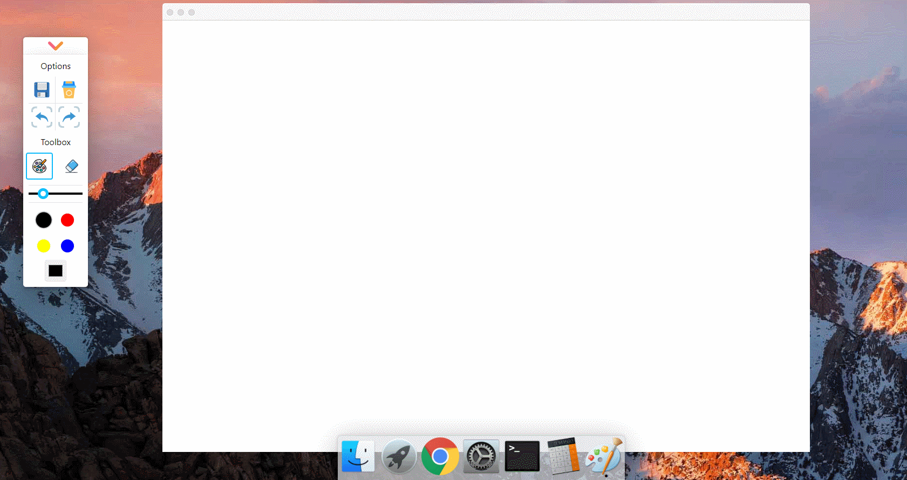
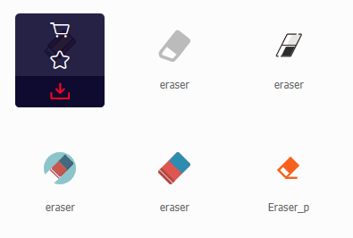
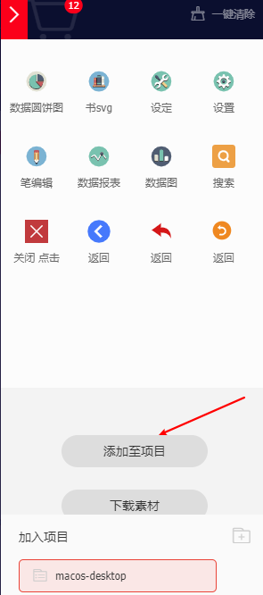
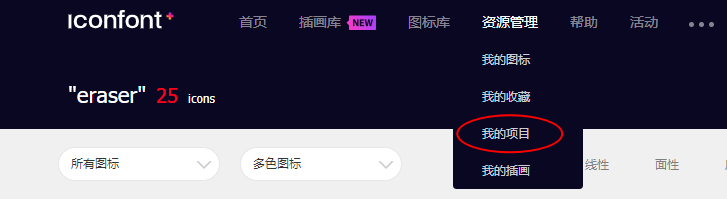
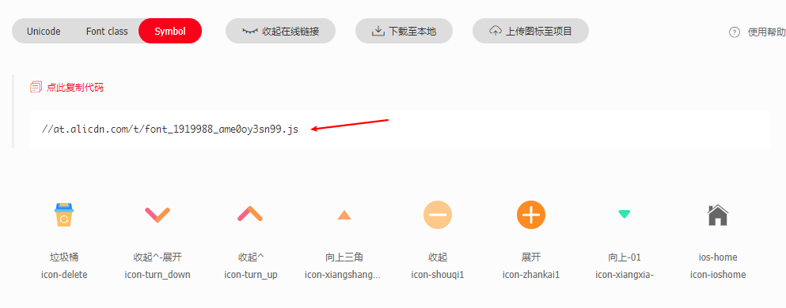

# 工具栏图标样式获取和封装

:dart: [项目地址](https://liucrystal24.github.io/macos-desk)，欢迎 watch :eyes: 和 star :star:
:book: [项目预览](https://liucrystal24.github.io/macos-desk)，点击即可查看

- ### 效果图

  

- ### 图标样式采样

  1. 图标样式获取地址：[阿里巴巴矢量图标库](https://www.iconfont.cn/)

  2. 选取适合自己的图标，加入购物车

     

  3. 将购物车里所有图标添加至项目

     

  4. 到 **资源管理** - **我的项目** 中查看项目内容

     

  5. 选择 **Symbol** ，并复制代码备用

     

- ### 封装 Iconfont 组件

  将工具栏中图标封装成组件，方便使用

  ```tsx
  import React, { CSSProperties, RefObject } from "react";

  const scriptElem = document.createElement("script");
  scriptElem.src = "//at.alicdn.com/t/font_1919988_ame0oy3sn99.js";
  document.body.appendChild(scriptElem);

  interface PropsTypes {
    className?: string;
    type: string;
    style?: object;
    svgRef?: RefObject<SVGSVGElement>;
    clickEvent?: (T: any) => void;
  }

  export const Iconfont = ({
    className,
    type,
    style,
    svgRef,
    clickEvent,
  }: PropsTypes) => {
    return (
      <svg
        ref={svgRef}
        className={className ? "icon-font " + className : "icon-font"}
        aria-hidden="true"
        style={style as CSSProperties}
        onClick={clickEvent}
      >
        <use xlinkHref={`#${type}`} />
      </svg>
    );
  };
  ```

- ### 工具栏开关动画

  引入 **CSSTransition**，并把工具栏功能放入其中，通过监听开关状态，改变开关图标，并开闭工具栏。

  ```tsx
  import { CSSTransition } from "react-transition-group";

  // 开关
  <div
    id="toolbox-open"
    style={
      {
        borderRadius: isToolboxOpen ? null : 5,
      } as CSSProperties
    }
  >
    <Iconfont
      type={isToolboxOpen ? "icon-turn_down" : "icon-turn_up"}
      style={{
        width: "100%",
        fontSize: 32,
      }}
      clickEvent={toolboxOpenClick}
    />
  </div>

  <CSSTransition
    in={isToolboxOpen}
    timeout={300}
    classNames="toolbox"
    unmountOnExit
  >
  // ... 此处添加工具栏图标
  </CSSTransition>
  ```
